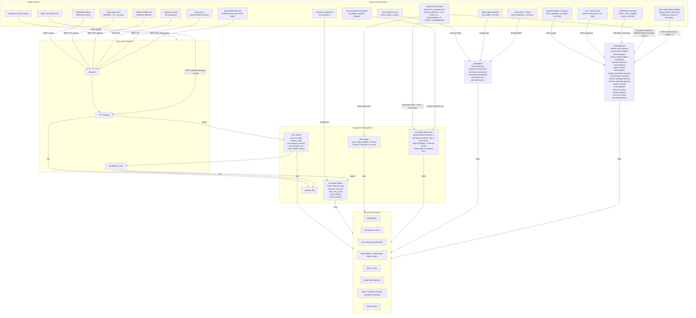
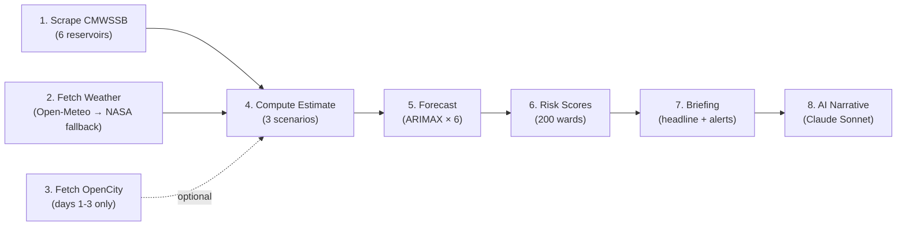
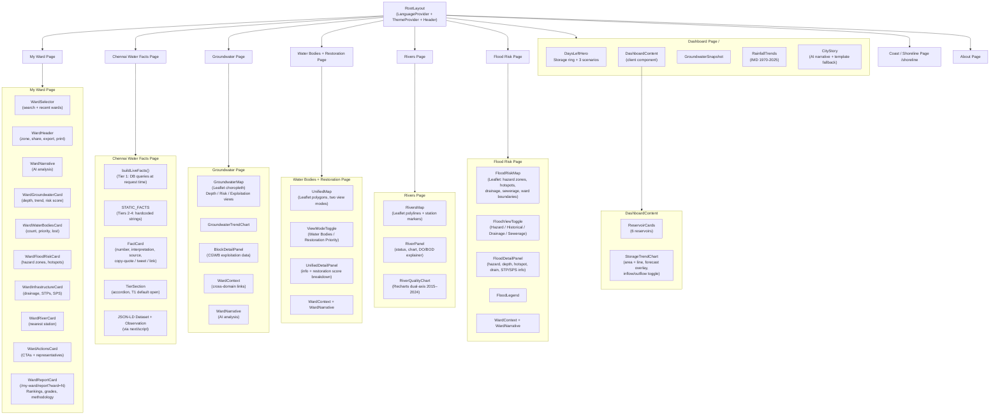

# Architecture

> Technical overview of Neer Vazhvu - Urban Water Intelligence platform (Chennai, Madurai, Bengaluru, Mumbai, Delhi and Kolkata live; multi-city by design; Mumbai is the first region place - the 9-corporation MMR, Delhi the first city with no ingestible daily supply feed, and Kolkata the first with no impounded storage at all, which is why it needed a fourth hero mode).

## System Overview



## Multi-city architecture

Every page that the user sees is keyed on a `cityId`. Chennai's pages live at the legacy flat routes (`/`, `/groundwater`, `/water-bodies` etc.) for back-compat; Madurai, Bengaluru, Mumbai, Delhi, Kolkata and future cities live under `/[cityId]/...`. The `tryGetPlaceConfig(cityId)` resolver loads a `PlaceConfig` from `src/lib/cities/{cityId}.ts` and that config drives:

- **`heroMode`** (`days-left` | `allocation` | `cauvery-pumping` | `drainage-capacity` | `none`) — picks the dashboard hero variant.
    - Chennai (`days-left`): divides total CMWSSB-reservoir storage by urban demand. Works because Chennai's reservoirs ARE the urban supply.
    - Madurai (`allocation`): anchors on Vaigai live storage + the city's published drinking-water allocation since the dams are irrigation-primary and shared across multiple districts.
    - Bengaluru (`cauvery-pumping`): tracks BWSSB's lift volume from T.K. Halli (~1,400-1,450 MLD) against Stage I-V design capacity (~2,225 MLD post-Stage V). Bangalore drinks 100 km away from the Cauvery so reservoir storage is not the right runway metric; pumping volume vs design is. Pairs with the IISc 80-ward stress overlay (April 2025 Outlook) since all 6 Bangalore Urban CGWB blocks are over-exploited and tap deficits show up as tanker dependency, not as reservoir percent.
    - Mumbai (`days-left`, region place): BMC's 7 lakes ARE the tap (Chennai-pattern), but the card states two caveats from config - `heroNote` labels the figure an upper bound (storage counts whole-dam water in state-owned dams while capacity is BMC's share), and the rain scenarios collapse to one line because the Pravah feed publishes no inflow data. Desal/inflow sliders hide when a city lacks the underlying data.
    - Delhi (`cauvery-pumping`, no live feed): the same variant as Bengaluru but a different story - nothing is pumped uphill; ~90% of raw water arrives by gravity canal from five other states under legal instruments (1994 Yamuna MoU, the 102-km Munak carrier, a BBMB-resolved Bhakra share, Tehri via the Upper Ganga Canal). Because the shared `pump.*` strings carry Bengaluru's specifics, Delhi overrides them through `hero_copy` in `delhi-supply-overview.json` rather than forking the component - the same escape hatch `_view_overrides` provides for the supply tile (incl. `demand_headline`, since Delhi's horizon is MPD-2041, not the ADB 2034 the default hard-codes).
    - Kolkata (`drainage-capacity`): the fourth mode, and the one that exists because a city can refuse the question entirely. Kolkata impounds NOTHING - run-of-river Hooghly abstraction plus tube wells - so `days-left` is not awkward here but *undefined*: there is no numerator. `cauvery-pumping` is equally wrong (it tells a lift-vs-design story; Palta is 22 km away on flat delta), and `allocation` needs a dam quota that does not exist. So the hero anchors on KMC's published drainage design standard - "designed to discharge a rainfall of 6 mm. per hour" - against measured HOURLY rainfall from `rainfall-intensity-<cityId>.json`, precomputed as a 10-threshold exceedance ladder so the slider moves without shipping ~230k hourly values. The standard is config (`drainageCapacity.standardMmPerHour`) with a citation, not a constant, because it varies by city (modern Indian codes use 12-25 mm/h) - so the mode is generic to any city that publishes one.
- **`waterSources`** — array of reservoirs/dams the city tracks, with `fullCapacityMcft`, `isPrimaryDrinkingSource`, etc. `isPrimaryDrinkingSource` is true only when the reservoir's storage IS the city's runway. Bangalore tracks 4 upstream Cauvery basin reservoirs (KRS, Hemavathi, Kabini, Harangi) but flags them all false because they're shared with irrigation + Mysuru + Mandya + the inter-state release to TN. Two honesty fields hang off each source: **`hasPublicFeed: false`** when no feed can ever deliver a reading (Mumbai's Vihar/Tulsi; *all six* of Delhi's sources), which excludes it from ingestion-liveness checks and from the "waiting for first daily ingestion" pill; and **`noFeedNote`**, which replaces the generic "<authority> does not publish daily levels" line when the authority that *would* publish is not the city's own utility - Bhakra is BBMB's to publish, not DJB's.
- **`urbanSupply`** (when `heroMode === 'allocation'`) — annual allocation (mcft/yr), recent draw, WTP capacity, supply chain description for the at-a-glance tile.
- **`groundwaterViews`** — feature flags for the groundwater page (`exploitation` / `depth` / `risk` / `cgwbStations`). Madurai disables `depth` + `risk` because per-ward IDW interpolation would be dishonest with only 4 live stations across the district; instead it surfaces `cgwbStations` (Year Book point overlay) on top of `exploitation` (block-level classification). Bengaluru disables `depth` for the same reason (13 CGWB telemetric stations across 369 GBA wards is too sparse to honestly IDW); it surfaces `exploitation` (6 blocks all Over-Exploited every year on record), `risk` (ward-risk composite), and `cgwbStations`.
- **`localGovernment`** — ward count + acronym (GCC 200 / MMC 100 / GBA 369 / BMC 24 / MCD 250) for help-text and authority labels.
- **`primaryAuthority`** — utility name (CMWSSB / MMC / TWAD / BWSSB / BMC / DJB) used in MissingDataCard reasons and About-page citations.
- **`availableLanguages`** — which UI languages render the language toggle for this city. Chennai: `['en', 'ta']`. Madurai: `['en', 'ta']`. Bengaluru: `['en', 'kn']`. Mumbai: `['en']` with `upcomingLanguages: ['mr']` - the switcher renders a greyed "coming soon" chip until the Marathi pass lands. Delhi follows the same posture with `upcomingLanguages: ['hi']`, and Kolkata with `upcomingLanguages: ['bn']`.
- **`placeKind` + `corporations[]`** — `'region'` models a metropolitan region rather than one corporation (Mumbai: the 9-corporation MMR). Region places render the `RegionalWaterSystem` dashboard section, and `dashboardScopes` supplies the scope badges ("Greater Mumbai · BMC's 7 lakes" vs "Mumbai Metropolitan Region · 9 corporations") so two geographies never blur on one dashboard.
- **Capability flags** — `hasCommitments`, `hasAllocationLedger`, `hasShoreline`, `hasCascadeOverlay`, etc. gate whole surfaces; `FEATURE_AVAILABILITY` in `src/lib/cities/routing.ts` is the single source of truth for nav, sitemap AND direct-URL 404s (e.g. Mumbai ships without my-ward until the ward build lands).
- **`sourceNameAliases`** — case-insensitive maps so the news-search query and reservoir-detail-dialog match a source under any spelling (e.g. "vaigai" / "vaigai dam" / "வைகை" → `vaigai`).

Per-city data files use a `-<cityId>` suffix in `public/data/` and `public/geojson/` (e.g. `madurai-supply-overview.json`, `bangalore-iisc-stress-wards-2025.json`, `imd-rainfall-monthly-bangalore.json`). Chennai keeps legacy unsuffixed paths for back-compat.

To add a new city, see the "Adding a new city" walkthrough in [CONTRIBUTING.md](CONTRIBUTING.md). The Kolkata onboarding is the most recent worked example and the best reference for a city that does NOT fit the existing shape - it added a hero mode, made `FloodConfig`'s dam fields optional in favour of a generic `primary_trigger`, generalised `RiverInfo`'s native-name field beyond Hindi, and added a `regionIntro` after Mumbai's nine-corporation copy leaked verbatim onto a three-unit region. Mumbai (PR #147) covers the region pattern; Bangalore (`bangalore_onboarding`) covers `cauvery-pumping` + localization; the Madurai onboarding (PR #97) is the canonical reference.

### The exemption register

Every deliberate omission on the platform is collected in one generated document,
[docs/architecture/exemptions.md](docs/architecture/exemptions.md), from
`scripts/lib/exemptions.ts`. Four kinds: a city skipping a freshness check, an artifact with no
Headwaters upstream to watch, a route a city does not ship, and an absence the product states on the
page (a catchment atlas refused on terrain grounds, a storage chart for a city that impounds
nothing, an untranslated UI language, a water source whose authority publishes no daily figure).

The register is derived rather than hand-listed, so it cannot drift: routes-off come from diffing
each city against the union of every route any city ships, and `npm run data:check` fails if the
committed copy is stale **or if any omission has no reason recorded**. That second gate is the point
- a page quietly dropped from `FEATURE_AVAILABILITY` now fails CI until someone writes down why.

The one exemption kind that suppresses a CI failure - a freshness check a city is allowed to skip -
is *owned* by that module rather than by the checker, so it cannot be edited without touching the
file that lists every omission. It is empty today, and empty is the correct steady state.

Omissions whose original rationale was never recorded are marked `UNRECORDED:` rather than
back-filled with a plausible guess, and counted separately. An invented justification reads as
authoritative and is worse than an admitted blank.

## Shared utilities

A few classifiers / scorers are city-agnostic and used across both cities:

- **`src/lib/utils/river-classification.ts`** — `computeRiverStatus(river)` returns one of `dead` / `severely_degraded` / `degraded` / `stressed` / `healthy` derived from each station's most recent NWMP reading via CPCB Designated Best-Use class thresholds (DO + BOD). Takes the worst classification across stations as the river-level status. Falls back to the JSON-declared `overall_status` when no station has any classifiable reading. Replaced hardcoded labels in late 2026 — Vaigai dropped from "severely_degraded" to "degraded" once the algorithm read the actual readings instead of inheriting the CPCB Polluted River Stretch (PRS) Priority III designation. Documented for end-users at the "How we classify river health" subsection on each city's About page.
- **`scripts/compute-ward-profiles.ts`** + **`scripts/compute-madurai-ward-profiles.ts`** — Build-time spatial-join scripts. The Madurai variant emits `_data_status: "not_available"` markers for sections it doesn't have data for (flood, drainage, sewerage, industrial); UI cards branch on this and render honest "not yet sourced" disclaimers rather than fabricated zero counts.

## City-specific dashboard surfaces

The dashboard component tree forks where each city's data landscape calls for it. Components are city-scoped today but generic — any future city with the matching `heroMode` config picks them up automatically.

### Madurai (`heroMode: 'allocation'`)

- **`AllocationHero`** (`src/components/dashboard/allocation-hero.tsx`) — replaces `DaysLeftHero`. Shows live dam fill %, four anchored stats (annual allocation, recent draw, allocation utilised, WTP capacity), and a "How to read this" caveat.
- **`UrbanSupplyOverview`** (`src/components/dashboard/urban-supply-overview.tsx`) — structural at-a-glance tile fed by `<cityId>-supply-overview.json`. Renders supply chain pipeline + source mix stacked bar + WTP capacity + distribution scale + 2034 demand vs supply gap.
- **`DataGapPanel`** (`src/components/dashboard/data-gap-panel.tsx`) — neutral-tone "What's missing today" inventory of layers the city utility tracks internally but doesn't publish. Generic shape; pass any DataGap[] array.
- **`MissingDataCard`** + **`MissingReservoirCard`** (`src/components/dashboard/missing-data-card.tsx`) — dashed-border treatment for tracked-but-unmonitored sources (Sothuparai Dam in Madurai's case). Generic; usable for river stations, AQI sensors, etc.

### Bengaluru (`heroMode: 'cauvery-pumping'`)

- **`CauveryPumpingHero`** (`src/components/dashboard/cauvery-pumping-hero.tsx`) — replaces `DaysLeftHero` + `AllocationHero`. Headline shows current Cauvery lift volume vs Stage I-V design capacity (e.g. "BWSSB lifts ~1,450 MLD against Stage V's 2,225 MLD design"), with 4 stat tiles (current lift, Stage V design, Stage V actual ≈ 400 MLD per The Ken Feb 2026, deficit). 6 callouts cover the 100 km / 600 m elevation pump chain, 33% wards on tankers, all 6 GW blocks Over-Exploited, etc.
- **`BangaloreDailyBriefing`** (`src/components/dashboard/bangalore-daily-briefing.tsx`) — template-based daily briefing card. Composes prose from `t()` keys against structured `fields` (returned by `buildBangaloreBriefing()` in `src/lib/insights/bangalore-briefing.ts`) so the briefing is fully localised. Five briefing variants pick by reservoir storage + tanker dependency. Open slot for a Claude-pipeline AI uplift via `aiOverride`.
- **`IIScStressWardsMap`** (`src/components/dashboard/iisc-stress-wards-{leaflet-,}map.tsx`) — the headline groundwater layer on `/bangalore`. Renders 80 critically-over-extracted BBMP wards (April 2025 IISc Outlook) as a percentile-coloured choropleth (0-100 composite score) over the 198 BBMP polygon set. Click any ward for its severity tier + composite score breakdown.
- **`TankerExpandedContext`** + **`TankerMarketPanel`** + **`TankerPageChrome`** — the `/bangalore/tanker` page composes longitudinal OpenCity survey data (2015 / 2019 / 2024) on what households actually pay vs BWSSB's official tariff, with tier-by-tier breakdowns and corridor-specific sites. All section headings + body fields read from per-language JSON variants (`_kn`, `_ta`) so the page is fully localised.

### Mumbai (region place, `heroMode: 'days-left'`)

- **`RegionalWaterSystem`** (`src/components/dashboard/regional-water-system.tsx`) — the Metropolitan Water System card, rendered only for `placeKind: 'region'`. LPCD-inequality ranking across the 9 corporations (bar chart against the CPHEEO 135 norm), scoreboard chips, per-corporation cards (supply/demand/deficit verdict chip + live Pravah storage pill), augmentation pipeline, numbered citations. Fed by `mmr-corporations-water.json` + `mmr-dam-storage.json`.
- **`DaysLeftHero` honesty extensions** (shared component; config-driven) — `heroNote` + `heroNoteSource` (upper-bound caveat + linked attribution), collapsed no-inflow scenarios stating the draw rate, slider gating, `scopeLabel` badge.
- **`FloodLinesSection`** (`src/components/flood/flood-lines-section.tsx`) — WRD red/blue flood-line sheets per river as collapsed rows; self-hides for cities without a `flood-lines-{cityId}.json`.
- **Accountability surfaces (all four cities)** — `allocations-client.tsx` (Allocation Ledger: entitled vs received per arrangement, instrument links, confidence + gap verdicts incl. "unreported") and `commitments-client.tsx` (Commitments Register: citation-gated statuses, append-only history). Both follow the verdict-first UX contract (scoreboard, collapsed rows, problems float) and deep-link into each other by entry id (hash scroll + auto-expand + highlight after client-side data load).
- **Data feeds via GitHub Actions (artifact-commit), not the API runtime** — `pravah-dam-refresh.yml` (daily reservoir storage), `rainfall-recent-refresh.yml` (daily provisional rainfall, all cities), `bmc-floodspots-refresh.yml` (weekly), `imd-rainfall-refresh.yml` (quarterly, all cities incl. Mumbai). One-off: `backfill_cwc_reservoirs.py` (Bhatsa + Upper Vaitarna weekly 2015-2025, insert-only-missing).

## Daily Pipeline

Triggered by GitHub Actions at 06:00 IST.

Production flow is:
1. GitHub Actions runs `python scripts/scrape_cmwssb.py` from the runner. If CMWSSB is unreachable, the scraper tolerates up to 4 days of stale data.
2. It then calls `POST /pipeline/run-post-scrape` for ETL + intelligence.

You can still run `POST /pipeline/run-daily` manually when the API runtime can directly access CMWSSB.



| Step | Source | Output Table | Frequency |
|------|--------|-------------|-----------|
| Scrape CMWSSB | cmwssb.tn.gov.in | `reservoir_daily` | Daily |
| Fetch Weather | open-meteo.com (primary) / power.larc.nasa.gov (fallback) | `weather_daily` | Daily (zero lag) |
| Fetch OpenCity | data.opencity.in | `groundwater_monthly` | Monthly (days 1-3) |
| Fetch WRIS Stations | indiawris.gov.in Ground Water Level API | `groundwater_wris` (and `groundwater_wris_latest` view with stuck/stale sensor quality flag) | Daily |
| Compute Estimate | Aggregated storage + inflow | `water_estimate_daily` | Daily |
| Forecast | StatsForecast ARIMAX | `reservoir_forecast` | Daily |
| Risk Scores | Groundwater + reservoir stress | `ward_risk_score` | Monthly |
| Briefing | Template-based rules | `daily_briefing` | Daily |
| AI City Narrative | Claude Sonnet API | `daily_briefing` (AI columns) | Daily |
| Fetch Census | data.gov.in (Water Bodies Census) | `water_bodies_census` | One-time / periodic |
| GEE Reservoir Context | CHIRPS via Earth Engine | `reservoir_catchment_context` | Daily (06:15 IST) |
| GEE Water-Body Summaries | Sentinel-2 NDWI + JRC via Earth Engine | `water_body_satellite_summary` | Weekly (Monday 06:45 IST) |
| Overture Buildings Refresh | Overture Maps quarterly parquet (DuckDB) | `public/data/rich-bodies/{body}-overture-buildings.json` (PR-gated when anomaly) | Monthly (1st of month) |

## Monthly Pipeline

Runs on IST days 1-3 via GitHub Actions (`--monthly` flag).

| Step | Source | Output Table | Frequency |
|------|--------|-------------|-----------|
| Fetch OpenCity | data.opencity.in | `groundwater_monthly` | Monthly |
| Risk Scores | Groundwater + reservoir stress | `ward_risk_score` | Monthly |
| AI Ward Narratives | Claude Haiku API (batched, 5/call) | `ward_narrative` | Monthly |
| AI City Narrative | Claude Sonnet API | `daily_briefing` (AI columns) | Monthly |

## Data Model


## Intelligence Layer

### ARIMAX Forecaster

Predicts reservoir storage 30 days ahead using [statsforecast](https://nixtla.github.io/statsforecast/) AutoARIMA with optional exogenous regressors (inflow/outflow + weather).

**Exogenous regressors (when available):**
- **Inflow/outflow** (cusecs) — always included when ≥30% non-zero coverage in last 2 years
- **Precipitation** (mm/day) — included when variance > 0.1 (skipped during dry spells to avoid rank deficiency)
- **ET₀** (mm/day) — reference evapotranspiration; included when variance > 0.1 (activates with seasonal temperature swings)

Weather data is joined from `weather_daily` (sourced from Open-Meteo). Future exogenous values blend recent conditions with historical seasonal averages.

```mermaid
flowchart TD
    A["Fetch reservoir history<br/>(storage + inflow + outflow)"]
    AW["Fetch weather history<br/>(precipitation + ET₀)"]
    AJ["Join by date"]
    B{"Data frequency?"}
    C["Daily<br/>season=365, horizon=30"]
    D["Monthly<br/>season=12, horizon=6"]
    E{"Inflow coverage<br/>≥30% in last 2 years?"}
    F{"Weather variance<br/>check (std > 0.1)"}
    G["ARIMAX<br/>(inflow + outflow + weather)"]
    H["ARIMAX<br/>(inflow + outflow only)"]
    I["ARIMA<br/>(storage only)"]
    J["Compute future exog<br/>(blend recent → seasonal)"]
    K["Forecast → clamp to 0..capacity"]

    A --> AJ
    AW --> AJ
    AJ --> B
    B -->|gap ≤ 15 days| C
    B -->|gap > 15 days| D
    C --> E
    D --> E
    E -->|Yes| F
    F -->|precip/ET₀ have variance| J
    J --> G
    F -->|low variance (dry spell)| H
    E -->|No| I
    G --> K
    H --> K
    I --> K
```

### Risk Scorer

Composite score (0–100) per ward, four weighted components:

| Component | Weight | Input |
|-----------|--------|-------|
| Groundwater depth | 40% | `groundwater_monthly` (≤3m = safe, >25m = crisis) |
| Year-on-year trend | 30% | Same month last year comparison |
| City reservoir stress | 20% | Total storage % across 6 reservoirs |
| Seasonal vulnerability | 10% | Month-based (monsoon = lower risk) |

### Days-Left Estimate

Three scenarios computed daily from current storage and net demand:

| Scenario | Inflow Assumption | Use Case |
|----------|-------------------|----------|
| Pessimistic | Zero inflow | Worst case / drought planning |
| Moderate | 7-day rolling avg inflow | Current conditions |
| Optimistic | Historical seasonal avg | Expected monsoon patterns |

**Key constants:** Consumption = 830 MLD, Desalination = 190 MLD (Minjur + Nemmeli).

### Ward Profile Index

Build-time spatial join mapping every data layer to Chennai's 200 GCC wards. Runs as `scripts/compute-ward-profiles.ts` using only committed repo files (no Supabase dependency). Output: `public/data/ward-profiles.json`.

**Layers indexed per ward:**
- Water bodies (OSM count, census records, restoration priority critical/high, top 3 bodies)
- Lost water bodies (count + names)
- Flood hazard zones (count by category, dominant hazard, 2015/2020 hotspot counts)
- Drainage lines (count)
- Sewerage infrastructure (STP count + capacity, SPS count, pumping main count)
- Nearest river station (ID + distance)
- Industrial zones (count)

**Determinism:** No `computed_at` field. Identical inputs produce byte-identical output. CI reruns the script and diffs to catch stale profiles.

### AI Narrative Generation

Daily and monthly AI narratives generated by `scripts/generate-narratives.ts` using the Anthropic Claude API.

| Scope | Model | Frequency | Output |
|-------|-------|-----------|--------|
| City briefing | Claude Sonnet | Daily | `daily_briefing.ai_*` columns |
| Ward narratives | Claude Haiku (batched, 5 wards/call) | Monthly | `ward_narrative` table (200 rows) |

**City narrative** reads reservoir storage, days-left estimates, ward risk distribution, and alerts. Outputs bilingual (English + Tamil) headline and bullet-point body.

**Ward narratives** combine ward profile data (from `ward-profiles.json`) with live groundwater depth/trend and risk scores (from Supabase). Each ward gets a bilingual headline, body, and key facts list.

**Source date freshness** is tracked per narrative - UI shows actual data dates (e.g., "Reservoirs: 27 Mar 2026 | Groundwater: Feb 2026"), not generation date.

**IST day gating:** Daily job skips IST days 1-3 (monthly job handles those days). Prevents race conditions between daily and monthly city narrative writes.

### Restoration Priority Ranker

Pre-computed (build-time) scoring of all 1,787 water bodies for restoration priority. Unlike the runtime intelligence layer, this uses only static spatial data and produces a static JSON file.

**Script:** `scripts/compute-restoration-priority.ts` → `public/data/restoration-priority.json`

| Component | Weight | Input |
|-----------|--------|-------|
| Water body size | 25% | `area_ha` from water bodies GeoJSON |
| Proximity to lost water bodies | 20% | Haversine distance to 15 lost bodies |
| Proximity to polluted rivers | 20% | Distance to 10 CPCB monitoring stations + latest DO |
| Industrial pollution proximity | 15% | Distance to 7 industrial sources |
| Water body type | 20% | OSM `water_type` tag (reservoir > lake > pond > canal) |

**Output:** Ranked list with composite score (0–100), component breakdown, and nearest feature references per water body.

### Rich-Data Deep-Zoom Panel (flagship water bodies)

21 flagship bodies have a dedicated full-screen panel layered on top of the standard `/water-bodies` map. Onboarded today: **8 in Chennai** (Pallikaranai Marsh, Sholavaram Lake, Red Hills/Puzhal, Chembarambakkam, Porur, Velachery, Perumbakkam, Chitlapakkam) + **13 in Bengaluru** (Bellandur, Varthur, Hesaraghatta, Hebbal, Ulsoor, Sankey, Madivala, Agara, Jakkur, Rachenahalli, Iblur, Kempambudhi, Puttenahalli, Yelahanka). The pattern is registry-driven so a new body needs no UI code, just a registry entry plus pipeline outputs.

**Registry:** [src/lib/water-bodies/rich-body-registry.ts](src/lib/water-bodies/rich-body-registry.ts) maps a `richBodyId` to the polygon path, buffer path, imagery manifest, analysis-JSON paths, timeline events, status badges, boundary source, and a `data_sources` block driving the in-panel sources & methodology modal.

**Build-time pipeline (all output to `public/`, no Supabase tables):**

| Step | Source | Output | Frequency |
|------|--------|--------|-----------|
| Fetch polygon | OSM Overpass relation/way; TNSWA QGIS web map for Pallikaranai | `public/geojson/rich-bodies/{body}.geojson` + `{body}-buffer-1000m.geojson` | One-time / on-demand |
| Verify zonal water trend (JRC) | JRC Global Surface Water v1.4 via GEE (annual 1984-2021) | `public/data/rich-bodies/{body}-jrc-water-trend.json` | One-time / on-demand |
| Verify zonal water trend (DW) | Dynamic World V1 water class via GEE (annual 2022-present, bridges JRC's 2021 cutoff) | `public/data/rich-bodies/{body}-dw-water-trend.json` | Yearly refresh |
| Verify zonal built trend | Dynamic World V1 built class via GEE (annual 2016-present) | `public/data/rich-bodies/{body}-dynamic-world-built-trend.json` | One-time / on-demand |
| Verify Open Buildings | Open Buildings v3 via GEE | `public/data/rich-bodies/{body}-open-buildings-verification.json` | One-time / on-demand |
| Refresh Overture buildings | Overture Maps parquet (DuckDB) | `public/data/rich-bodies/{body}-overture-buildings.json` | Monthly via `.github/workflows/overture-buildings-refresh.yml` (PR-gated when anomaly) |
| Ingest yearly chips | Landsat 5/7/8 (1984-2018) + Sentinel-2 SR Harmonized (2019-present) via GEE | `public/data/rich-bodies/imagery/{body}/*.jpg` + `{body}-imagery-manifest.json` (merges with existing chips so partial-year re-runs don't wipe history) | One-time per onboarding; re-run when newer imagery is desired |
| Ingest water-loss tint | JRC GSW v1.4 two-window comparison: water in ≥3 of [1988-92] AND not water in ≥3 of [2017-21] | `public/data/rich-bodies/tints/{body}/water-loss.png` | One-time / on-demand |
| Ingest built-gain tint | Dynamic World V1 two-window comparison: built in ≥2 of [2023-25] but not in ≥2 of [2016-18] | `public/data/rich-bodies/tints/{body}/built-gain.png` | One-time / on-demand |

**JRC → DW water-trend splice.** JRC GSW v1.4 ships annual classification through 2021. Without a bridge, the per-body water-fraction chart truncates at 2021 - misleading for bodies whose recent dynamics matter (e.g. Bellandur, Varthur). The DW water-class extension (class 0) provides 2022-present in the same shape (`any_water_pct` key), spliced in `rich-body-stats-strip.tsx`: years ≤2021 read from JRC, years ≥2022 read from DW. Methodology disclosed in the in-panel sources modal.

**Zones (body-agnostic, defined in [scripts/_rich_body_zones.py](scripts/_rich_body_zones.py)):**

- `Body (primary)` - the body's main boundary (TNSWA gazette for Pallikaranai, OSM for the rest)
- `OSM ecological` (Pallikaranai only) - the OSM `natural=wetland` polygon for the marsh
- `Gap: body - OSM ecological` (Pallikaranai only) - the set-difference, currently 233.06 ha (gazette - OSM)
- `Halo: 1km buffer - body` - the donut ring outside the body's edge

The four `scripts/verify_rich_body_*.py` scripts take `--body-id` and emit the same zone names regardless of source, so the frontend stats strip is body-agnostic.

**Frontend:** A click on a flagship body opens a full-screen overlay ([src/components/water-bodies/rich-body-overlay.tsx](src/components/water-bodies/rich-body-overlay.tsx)). The map ([rich-body-map.tsx](src/components/water-bodies/rich-body-map.tsx)) renders 5 explicit Leaflet panes (z-index 410-490) to stack chips, tints, polygon, halo, and labels deterministically. The slider ([rich-body-timeline-slider.tsx](src/components/water-bodies/rich-body-timeline-slider.tsx)) supports play/pause time-lapse with era bands (Landsat 5 / 5+7 / 7+8 / Sentinel-2) and event stamps. The stats strip ([rich-body-stats-strip.tsx](src/components/water-bodies/rich-body-stats-strip.tsx)) shows 4 stats per year (body water %, halo built %, halo buildings, body buildings) with delta-vs-baseline indicators. The sources modal ([rich-body-sources-modal.tsx](src/components/water-bodies/rich-body-sources-modal.tsx)) reads `data_sources` from the registry.

All chips are pre-loaded into the browser cache via `new Image().src = url` on manifest load to eliminate flicker during play/drag. There is no GEE round-trip at view time.

### Lake Catchment Atlas (`/[city]/water-bodies` → "Catchments" view)

A terrain-derived, clickable area-of-influence layer for every lake/tank, live for Chennai, Madurai, Bengaluru and Mumbai. Where the cascade reconstruction (90 m HydroSHEDS, tank-to-tank edges) is the district-scale skeleton, the atlas delineates the **contributing area** per lake from a 30 m bare-earth DEM. Full methodology: [docs/methodology/catchment-atlas-v1.md](docs/methodology/catchment-atlas-v1.md). (Design specs live in local archives; the methodology doc is the maintained record.)

**Build-time pipeline** ([neer-vazhvu-api/app/cascade/catchments.py](neer-vazhvu-api/app/cascade/catchments.py), algorithm `catchments_fabdem_wbt_v1`):

| Step | Source / tool | Output |
|------|---------------|--------|
| DEM mosaic + condition | FABDEM 30 m (GEE `projects/sat-io/open-datasets/FABDEM`) + WhiteboxTools `breach_depressions_least_cost` | cached UTM rasters |
| Flow routing + streams | WBT D8 pointer / accumulation / `extract_streams` / Strahler / vectorize + Chaikin smooth | `{city}-catchment-streams.json` |
| Own / received / total catchment | upstream BFS over D8, barriered by other water bodies (threshold-free; own + received = total) | `{city}-cascade-catchments.geojson` (own), `{city}-catchment-basin.json` (total) |
| Downstream flow path + `drains_to` | max-accumulation neighbour trace, chained along the cascade to the river | `{city}-catchment-downstream.json` |
| False-river filter | name regex OR thin-ribbon (Polsby-Popper < 0.05 AND catchment/area ratio > 100) | excluded conduits |
| Rooftop harvest | Overture footprints (DuckDB) clipped to own catchment × IMD rainfall normal × 0.8 | embedded in lakes layer |
| Names + downstream river | `app/cascade/enrich_names.py` (auto at build end; also a CLI) - syncs names from source, snaps each terminal lake's path to the nearest named river | `drains_to_river_name`, `name` / `name_source` |

**Naming backfill:** OSM under-names water bodies (Chennai ~78%, Bengaluru ~67% unnamed at ingest). [scripts/name-bangalore-water-bodies.py](scripts/name-bangalore-water-bodies.py) polygon-overlap-joins the ATREE/CSEI named-lake census (OpenCity) into the Bengaluru source geojson (446 toponyms, with `name_source`/`name_match_iou` provenance; OSM names never overwritten). `enrich_names.py` re-applies names + river labels onto the published lake layer keyed by `osm_id`, so a name refresh never needs a full re-delineation.

**Serving:** the clickable lake layer is one static GeoJSON (`{city}-cascade-lakes.geojson`, all panel stats embedded). On click, [src/app/api/cascade/[cityId]/catchment/route.ts](src/app/api/cascade/[cityId]/catchment/route.ts) returns `{ catchment, basin, streams, downstream }` for that `osm_id` (module-scope cached). **Frontend** [src/components/cascade/catchment-atlas.tsx](src/components/cascade/catchment-atlas.tsx) is a `/water-bodies` view mode (persisted via `?mode=catchments`, carried across city switches): one map, click-to-emphasise (own catchment solid orange, inherited basin dashed amber, streams Strahler-graded blue, downstream flow dotted violet), with a side panel showing the own/received/total hierarchy, named clickable upstream/downstream lists, the named downstream river, and rooftop-harvest potential. The panel deep-links to the about-page methodology (`#catchment-methodology`).

### Coastal Shoreline-Change (`/shoreline`, Chennai)

A two-layer map of erosion/accretion along the 86 km Chennai-Ennore-Pulicat coast (1990-2024), keyed to Anagha, Singh & Frappart (2026, *Environmental Challenges*). Unlike the daily/weekly pipelines this is an **on-demand build**, not a cron job. Every feature carries a `source` field (`study-reported` vs `computed`) so the UI labels provenance honestly.

| Layer | Built by | Source tag | Method |
|-------|----------|------------|--------|
| Zones + hotspots (seed) | [scripts/build-chennai-coastal-seed.py](scripts/build-chennai-coastal-seed.py) | `study-reported` | OSM coastline (Overpass) stitched → seaward shore → split into the study's 6 zones by published along-shore lengths; per-zone rates + 5 port hotspots attached |
| Transects (our own) | [neer-vazhvu-api/app/gee/coastline.py](neer-vazhvu-api/app/gee/coastline.py) via [run_gee_coastline.py](neer-vazhvu-api/scripts/run_gee_coastline.py) | `computed` | 8-band MNDWI (Landsat 5/7/8 + Sentinel-2, dry-season composites) sampled along 972 shore-normal 100 m transects in GEE; land→water crossing per epoch; DSAS-equivalent EPR + weighted linear regression (weights = 1/Esp²) → 895 transects |

The two methods are independent: stage 2 (transect geometry + DSAS regression) is pure NumPy and unit-testable; only stage 1 (MNDWI sampling) touches GEE. They agree on pattern and sign (Zone V around Ennore/Kattupalli most eroded; Adyar/Cooum + Chennai Port accrete), with our absolute rates lower (fixed MNDWI threshold, no tidal correction) - presented as independent corroboration. Each computed transect also carries a per-year movement `series` + early/recent split rates, so the panel shows a shoreline-movement-over-time chart and an acceleration flag (~66% of eroding transects are eroding faster post-2015). **Frontend** [src/components/coastal/coastal-map.tsx](src/components/coastal/coastal-map.tsx) is a Leaflet map with a "Study zones" / "Our transects" toggle; types in [src/types/coastal.ts](src/types/coastal.ts), gated by `coastal` in `FEATURE_AVAILABILITY` ([src/lib/cities/routing.ts](src/lib/cities/routing.ts)). **Cadence:** yearly (annual dry-season epochs) - `active_epoch_config()` auto-appends the latest complete year and `.github/workflows/coastal-shoreline-refresh.yml` opens a refresh PR each 15 June. Publication-style write-up: [docs/methodology/coastal-shoreline-change-v1.md](docs/methodology/coastal-shoreline-change-v1.md); internal notes: [docs/research/chennai-coast-paper/METHODS.md](docs/research/chennai-coast-paper/METHODS.md).

## Frontend



### Connected Insights Layer

Detail panels in groundwater and water bodies pages include threshold-gated cross-domain insights. These surface automatically when a risk or restoration score component exceeds its threshold, connecting the user to the underlying cause.

**Groundwater ward panels** show insights for:
- Reservoir stress contribution (when `reservoirComponent >= 12/20`)
- Groundwater depth dominance (when `groundwaterComponent >= 60/100`)
- Declining trend (when `trendComponent >= 60/100`)
- Seasonal vulnerability (when `seasonalComponent >= 60/100`)
- Action nudge based on the dominant risk factor (harvest, recharge, or reservoir advocacy)

**Water body detail panels** show insights for:
- Lost water body proximity (when `lost_proximity >= 55/100`)
- Industrial pollution proximity (when `industrial_proximity >= 55/100`)

Thresholds are centralized in `src/lib/insights/constants.ts`.

### Deep Linking

Pages support URL query parameters for cross-page navigation from ward context panels:

| Page | Parameters | Behavior |
|------|-----------|----------|
| `/my-ward` | `?ward=N` | Loads full ward report for ward N |
| `/my-ward/report` | `?ward=N` | Print-optimized report card with rankings and grades |
| `/groundwater` | `?ward=N` | Pre-selects ward N in the detail panel |
| `/water-bodies` | `?mode=restoration&ward=N` | Sets restoration view, finds ward's top water body, flies map to it |
| `/flood-risk` | `?ward=N` | Flies map to ward centroid |
| `/flood-risk` | `?view=drainage&ward=N` | Initializes drainage view and flies to ward |
| `/rivers` | `?river=R&station=S` | Pre-selects river and station |

Map pages use a `FlyToCenter` component (via `useMap()` from react-leaflet) to animate the map to the target coordinates.

### Localization (i18n)

Custom context-based i18n supporting English, Tamil, and Kannada. No external i18n library — lightweight implementation using React Context. Per-city `availableLanguages` in `CityConfig` controls which languages the toggle exposes for that city.

```
RootLayout
  └─ LanguageProvider (React Context)
       ├─ language state (persisted to localStorage as "neer-vazhvu-lang")
       ├─ t(key) → looks up translations[key][language]
       └─ setLanguage() → updates state + localStorage + document.lang
```

- **Translation file:** `src/lib/i18n/translations.ts` (~1,500 keys, 100% EN/TA/KN coverage)
- **Reservoir names:** `src/lib/i18n/reservoir-name.ts`
- **Per-city availableLanguages:** Chennai/Madurai expose EN + TA; Bengaluru exposes EN + KN. The language toggle in the header filters its options against the active city's `availableLanguages`.
- **Per-language JSON field picking:** For city data files where prose differs per-language (tanker-context, facts), entries carry parallel `_ta` and `_kn` suffixes (e.g. `headline`, `headline_ta`, `headline_kn`) and a `pickLang()` helper resolves them.
- **Long-form stories:** Chennai (`src/content/story-chennai.tsx`) and Madurai (`src/content/story-madurai.tsx`) ship EN + TA via inline mixing. Bangalore (`src/content/story-bangalore.tsx`) dispatches to per-language modules (`story-bangalore-en.tsx`, `story-bangalore-kn.tsx`) for the 4-chapter long-form because the prose volume justified the split.
- **Validation script:** `npm run i18n:check` (ensures every translation key has TA + KN values)
- **Hydration safety:** Language loaded in `useEffect` after mount to avoid SSR mismatch

### Demo Mode

When Supabase is not configured (env vars missing), the dashboard falls back to `src/lib/mock-data.ts` with realistic synthetic data. This allows contributors to work on UI without database setup. The fallback is triggered at the page level — individual components receive data as props and are unaware of the data source.

**Data flow:** Supabase → Server Component (ISR, 15-min revalidation) → Client Components (charts, interactivity). Demo mode with mock data when Supabase is not configured.

## API Endpoints

| Method | Path | Auth | Description |
|--------|------|------|-------------|
| GET | `/health` | None | Service health + recent pipeline runs |
| POST | `/pipeline/run-daily` | Bearer | Full daily pipeline (includes scrape) |
| POST | `/pipeline/run-post-scrape` | Bearer | Daily pipeline without scrape (used by GH Actions) |
| POST | `/pipeline/run-monthly` | Bearer | Groundwater + risk scoring |
| POST | `/pipeline/run-intelligence` | Bearer | Forecast + risk + briefing only |
| GET | `/intelligence/forecast` | None | Latest reservoir forecasts |
| GET | `/intelligence/risk-scores` | None | Ward-level risk scores |
| GET | `/intelligence/briefing` | None | Daily intelligence briefing |
| GET | `/api/groundwater/ward?ward=N` | None | Single ward groundwater depth + trend + risk |
| GET | `/api/narratives/city` | None | Latest AI city narrative |
| GET | `/api/narratives/ward?ward=N` | None | Latest AI ward narrative |
