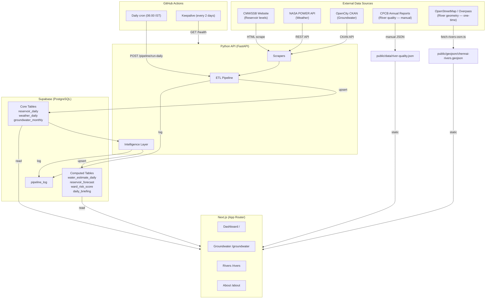
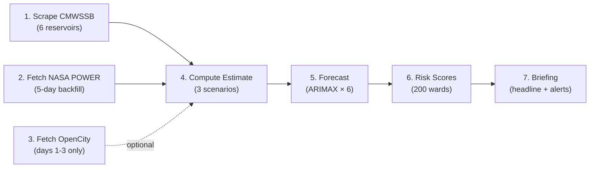
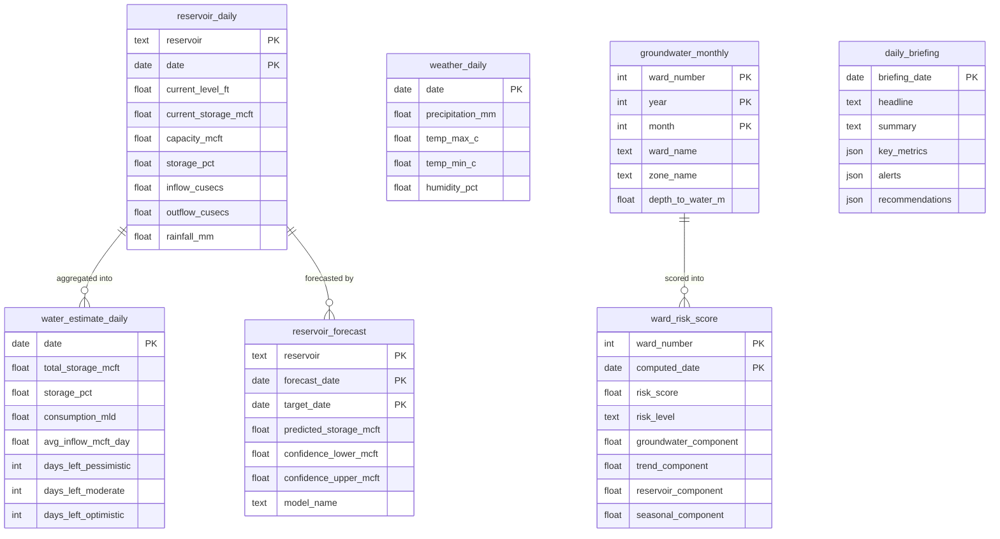
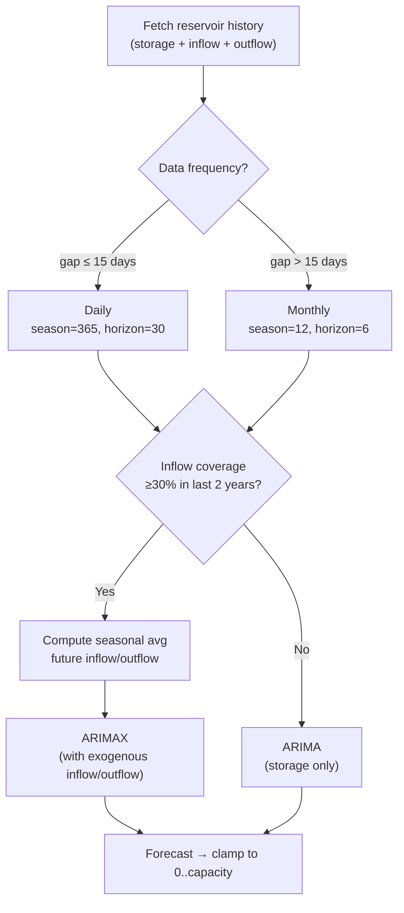
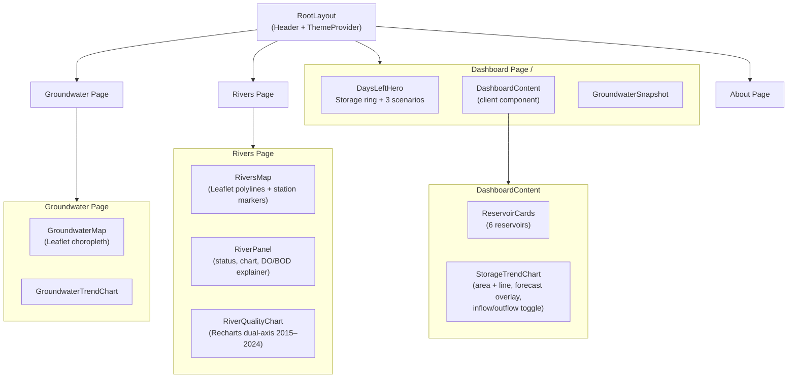

# Architecture

> Technical overview of Neer Vazhvu — Chennai Water Intelligence Dashboard.

## System Overview

## Daily Pipeline

Triggered by GitHub Actions at 06:00 IST, or manually via `POST /pipeline/run-daily`.

| Step | Source | Output Table | Frequency |
|------|--------|-------------|-----------|
| Scrape CMWSSB | cmwssb.tn.gov.in | `reservoir_daily` | Daily |
| Fetch NASA POWER | power.larc.nasa.gov | `weather_daily` | Daily (2-day lag) |
| Fetch OpenCity | data.opencity.in | `groundwater_monthly` | Monthly (days 1-3) |
| Compute Estimate | Aggregated storage + inflow | `water_estimate_daily` | Daily |
| Forecast | StatsForecast ARIMAX | `reservoir_forecast` | Daily |
| Risk Scores | Groundwater + reservoir stress | `ward_risk_score` | Monthly |
| Briefing | Template-based rules | `daily_briefing` | Daily |

## Data Model

## Intelligence Layer

### ARIMAX Forecaster

Predicts reservoir storage 30 days ahead using [statsforecast](https://nixtla.github.io/statsforecast/) AutoARIMA with optional exogenous regressors (inflow/outflow).

### Risk Scorer

Composite score (0–100) per ward, four weighted components:

| Component | Weight | Input |
|-----------|--------|-------|
| Groundwater depth | 40% | `groundwater_monthly` (≤3m = safe, >25m = crisis) |
| Year-on-year trend | 30% | Same month last year comparison |
| City reservoir stress | 20% | Total storage % across 6 reservoirs |
| Seasonal vulnerability | 10% | Month-based (monsoon = lower risk) |

### Days-Left Estimate

Three scenarios computed daily from current storage and net demand:

| Scenario | Inflow Assumption | Use Case |
|----------|-------------------|----------|
| Pessimistic | Zero inflow | Worst case / drought planning |
| Moderate | 7-day rolling avg inflow | Current conditions |
| Optimistic | Historical seasonal avg | Expected monsoon patterns |

**Key constants:** Consumption = 830 MLD, Desalination = 190 MLD (Minjur + Nemmeli).

## Frontend

**Data flow:** Supabase → Server Component (ISR, 15-min revalidation) → Client Components (charts, interactivity). Demo mode with mock data when Supabase is not configured.

## API Endpoints

| Method | Path | Auth | Description |
|--------|------|------|-------------|
| GET | `/health` | None | Service health + recent pipeline runs |
| POST | `/pipeline/run-daily` | Bearer | Full daily pipeline |
| POST | `/pipeline/run-monthly` | Bearer | Groundwater + risk scoring |
| POST | `/pipeline/run-intelligence` | Bearer | Forecast + risk + briefing only |
| GET | `/intelligence/forecast` | None | Latest reservoir forecasts |
| GET | `/intelligence/risk-scores` | None | Ward-level risk scores |
| GET | `/intelligence/briefing` | None | Daily intelligence briefing |
