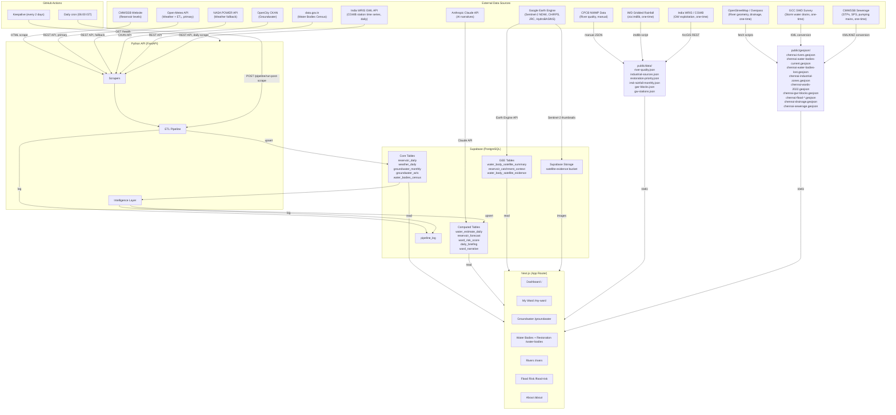
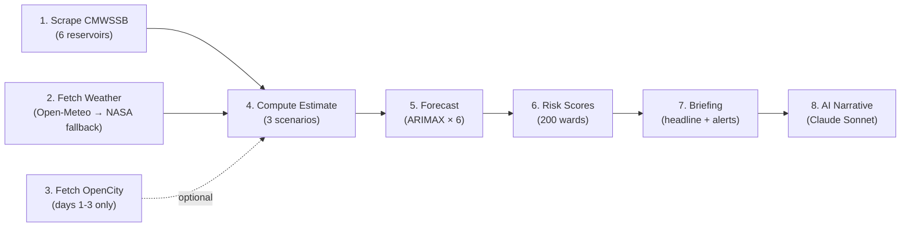
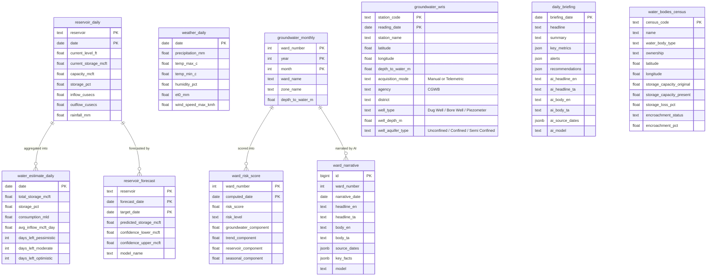
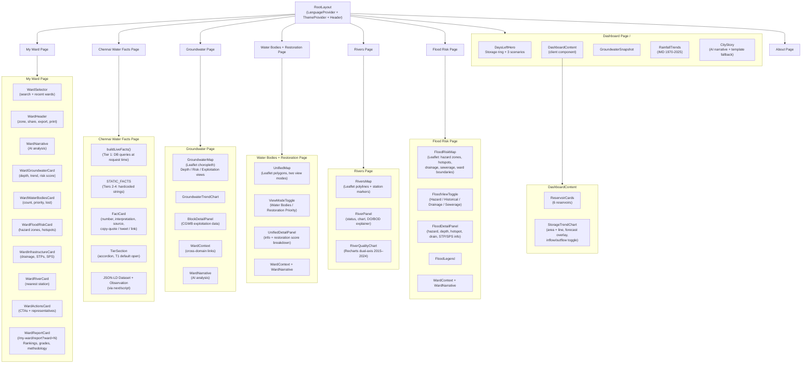

# Architecture

> Technical overview of Neer Vazhvu - Chennai Water Intelligence Dashboard.

## System Overview



## Daily Pipeline

Triggered by GitHub Actions at 06:00 IST.

Production flow is:
1. GitHub Actions runs `python scripts/scrape_cmwssb.py` from the runner. If CMWSSB is unreachable, the scraper tolerates up to 4 days of stale data.
2. It then calls `POST /pipeline/run-post-scrape` for ETL + intelligence.

You can still run `POST /pipeline/run-daily` manually when the API runtime can directly access CMWSSB.



| Step | Source | Output Table | Frequency |
|------|--------|-------------|-----------|
| Scrape CMWSSB | cmwssb.tn.gov.in | `reservoir_daily` | Daily |
| Fetch Weather | open-meteo.com (primary) / power.larc.nasa.gov (fallback) | `weather_daily` | Daily (zero lag) |
| Fetch OpenCity | data.opencity.in | `groundwater_monthly` | Monthly (days 1-3) |
| Fetch WRIS Stations | indiawris.gov.in Ground Water Level API | `groundwater_wris` (and `groundwater_wris_latest` view with stuck/stale sensor quality flag) | Daily |
| Compute Estimate | Aggregated storage + inflow | `water_estimate_daily` | Daily |
| Forecast | StatsForecast ARIMAX | `reservoir_forecast` | Daily |
| Risk Scores | Groundwater + reservoir stress | `ward_risk_score` | Monthly |
| Briefing | Template-based rules | `daily_briefing` | Daily |
| AI City Narrative | Claude Sonnet API | `daily_briefing` (AI columns) | Daily |
| Fetch Census | data.gov.in (Water Bodies Census) | `water_bodies_census` | One-time / periodic |
| GEE Reservoir Context | CHIRPS via Earth Engine | `reservoir_catchment_context` | Daily (06:15 IST) |
| GEE Water-Body Summaries | Sentinel-2 NDWI + JRC via Earth Engine | `water_body_satellite_summary` | Weekly (Monday 06:45 IST) |
| GEE Satellite Evidence | Sentinel-2 NDWI via Earth Engine | `water_body_satellite_evidence` + Storage | Manual dispatch / run-all-refresh |

## Monthly Pipeline

Runs on IST days 1-3 via GitHub Actions (`--monthly` flag).

| Step | Source | Output Table | Frequency |
|------|--------|-------------|-----------|
| Fetch OpenCity | data.opencity.in | `groundwater_monthly` | Monthly |
| Risk Scores | Groundwater + reservoir stress | `ward_risk_score` | Monthly |
| AI Ward Narratives | Claude Haiku API (batched, 5/call) | `ward_narrative` | Monthly |
| AI City Narrative | Claude Sonnet API | `daily_briefing` (AI columns) | Monthly |

## Data Model



## Intelligence Layer

### ARIMAX Forecaster

Predicts reservoir storage 30 days ahead using [statsforecast](https://nixtla.github.io/statsforecast/) AutoARIMA with optional exogenous regressors (inflow/outflow + weather).

**Exogenous regressors (when available):**
- **Inflow/outflow** (cusecs) — always included when ≥30% non-zero coverage in last 2 years
- **Precipitation** (mm/day) — included when variance > 0.1 (skipped during dry spells to avoid rank deficiency)
- **ET₀** (mm/day) — reference evapotranspiration; included when variance > 0.1 (activates with seasonal temperature swings)

Weather data is joined from `weather_daily` (sourced from Open-Meteo). Future exogenous values blend recent conditions with historical seasonal averages.

```mermaid
flowchart TD
    A["Fetch reservoir history<br/>(storage + inflow + outflow)"]
    AW["Fetch weather history<br/>(precipitation + ET₀)"]
    AJ["Join by date"]
    B{"Data frequency?"}
    C["Daily<br/>season=365, horizon=30"]
    D["Monthly<br/>season=12, horizon=6"]
    E{"Inflow coverage<br/>≥30% in last 2 years?"}
    F{"Weather variance<br/>check (std > 0.1)"}
    G["ARIMAX<br/>(inflow + outflow + weather)"]
    H["ARIMAX<br/>(inflow + outflow only)"]
    I["ARIMA<br/>(storage only)"]
    J["Compute future exog<br/>(blend recent → seasonal)"]
    K["Forecast → clamp to 0..capacity"]

    A --> AJ
    AW --> AJ
    AJ --> B
    B -->|gap ≤ 15 days| C
    B -->|gap > 15 days| D
    C --> E
    D --> E
    E -->|Yes| F
    F -->|precip/ET₀ have variance| J
    J --> G
    F -->|low variance (dry spell)| H
    E -->|No| I
    G --> K
    H --> K
    I --> K
```

### Risk Scorer

Composite score (0–100) per ward, four weighted components:

| Component | Weight | Input |
|-----------|--------|-------|
| Groundwater depth | 40% | `groundwater_monthly` (≤3m = safe, >25m = crisis) |
| Year-on-year trend | 30% | Same month last year comparison |
| City reservoir stress | 20% | Total storage % across 6 reservoirs |
| Seasonal vulnerability | 10% | Month-based (monsoon = lower risk) |

### Days-Left Estimate

Three scenarios computed daily from current storage and net demand:

| Scenario | Inflow Assumption | Use Case |
|----------|-------------------|----------|
| Pessimistic | Zero inflow | Worst case / drought planning |
| Moderate | 7-day rolling avg inflow | Current conditions |
| Optimistic | Historical seasonal avg | Expected monsoon patterns |

**Key constants:** Consumption = 830 MLD, Desalination = 190 MLD (Minjur + Nemmeli).

### Ward Profile Index

Build-time spatial join mapping every data layer to Chennai's 200 GCC wards. Runs as `scripts/compute-ward-profiles.ts` using only committed repo files (no Supabase dependency). Output: `public/data/ward-profiles.json`.

**Layers indexed per ward:**
- Water bodies (OSM count, census records, restoration priority critical/high, top 3 bodies)
- Lost water bodies (count + names)
- Flood hazard zones (count by category, dominant hazard, 2015/2020 hotspot counts)
- Drainage lines (count)
- Sewerage infrastructure (STP count + capacity, SPS count, pumping main count)
- Nearest river station (ID + distance)
- Industrial zones (count)

**Determinism:** No `computed_at` field. Identical inputs produce byte-identical output. CI reruns the script and diffs to catch stale profiles.

### AI Narrative Generation

Daily and monthly AI narratives generated by `scripts/generate-narratives.ts` using the Anthropic Claude API.

| Scope | Model | Frequency | Output |
|-------|-------|-----------|--------|
| City briefing | Claude Sonnet | Daily | `daily_briefing.ai_*` columns |
| Ward narratives | Claude Haiku (batched, 5 wards/call) | Monthly | `ward_narrative` table (200 rows) |

**City narrative** reads reservoir storage, days-left estimates, ward risk distribution, and alerts. Outputs bilingual (English + Tamil) headline and bullet-point body.

**Ward narratives** combine ward profile data (from `ward-profiles.json`) with live groundwater depth/trend and risk scores (from Supabase). Each ward gets a bilingual headline, body, and key facts list.

**Source date freshness** is tracked per narrative - UI shows actual data dates (e.g., "Reservoirs: 27 Mar 2026 | Groundwater: Feb 2026"), not generation date.

**IST day gating:** Daily job skips IST days 1-3 (monthly job handles those days). Prevents race conditions between daily and monthly city narrative writes.

### Restoration Priority Ranker

Pre-computed (build-time) scoring of all 1,787 water bodies for restoration priority. Unlike the runtime intelligence layer, this uses only static spatial data and produces a static JSON file.

**Script:** `scripts/compute-restoration-priority.ts` → `public/data/restoration-priority.json`

| Component | Weight | Input |
|-----------|--------|-------|
| Water body size | 25% | `area_ha` from water bodies GeoJSON |
| Proximity to lost water bodies | 20% | Haversine distance to 15 lost bodies |
| Proximity to polluted rivers | 20% | Distance to 10 CPCB monitoring stations + latest DO |
| Industrial pollution proximity | 15% | Distance to 7 industrial sources |
| Water body type | 20% | OSM `water_type` tag (reservoir > lake > pond > canal) |

**Output:** Ranked list with composite score (0–100), component breakdown, and nearest feature references per water body.

## Frontend



### Connected Insights Layer

Detail panels in groundwater and water bodies pages include threshold-gated cross-domain insights. These surface automatically when a risk or restoration score component exceeds its threshold, connecting the user to the underlying cause.

**Groundwater ward panels** show insights for:
- Reservoir stress contribution (when `reservoirComponent >= 12/20`)
- Groundwater depth dominance (when `groundwaterComponent >= 60/100`)
- Declining trend (when `trendComponent >= 60/100`)
- Seasonal vulnerability (when `seasonalComponent >= 60/100`)
- Action nudge based on the dominant risk factor (harvest, recharge, or reservoir advocacy)

**Water body detail panels** show insights for:
- Lost water body proximity (when `lost_proximity >= 55/100`)
- Industrial pollution proximity (when `industrial_proximity >= 55/100`)

Thresholds are centralized in `src/lib/insights/constants.ts`.

### Deep Linking

Pages support URL query parameters for cross-page navigation from ward context panels:

| Page | Parameters | Behavior |
|------|-----------|----------|
| `/my-ward` | `?ward=N` | Loads full ward report for ward N |
| `/my-ward/report` | `?ward=N` | Print-optimized report card with rankings and grades |
| `/groundwater` | `?ward=N` | Pre-selects ward N in the detail panel |
| `/water-bodies` | `?mode=restoration&ward=N` | Sets restoration view, finds ward's top water body, flies map to it |
| `/flood-risk` | `?ward=N` | Flies map to ward centroid |
| `/flood-risk` | `?view=drainage&ward=N` | Initializes drainage view and flies to ward |
| `/rivers` | `?river=R&station=S` | Pre-selects river and station |

Map pages use a `FlyToCenter` component (via `useMap()` from react-leaflet) to animate the map to the target coordinates.

### Localization (i18n)

Custom context-based i18n supporting English and Tamil. No external i18n library — lightweight implementation using React Context.

```
RootLayout
  └─ LanguageProvider (React Context)
       ├─ language state (persisted to localStorage as "neer-vazhvu-lang")
       ├─ t(key) → looks up translations[key][language]
       └─ setLanguage() → updates state + localStorage + document.lang
```

- **Translation file:** `src/lib/i18n/translations.ts` (~665 keys)
- **Reservoir names:** `src/lib/i18n/reservoir-name.ts`
- **Validation script:** `npm run i18n:check` (ensures Tamil translation exists for every key)
- **Hydration safety:** Language loaded in `useEffect` after mount to avoid SSR mismatch

### Demo Mode

When Supabase is not configured (env vars missing), the dashboard falls back to `src/lib/mock-data.ts` with realistic synthetic data. This allows contributors to work on UI without database setup. The fallback is triggered at the page level — individual components receive data as props and are unaware of the data source.

**Data flow:** Supabase → Server Component (ISR, 15-min revalidation) → Client Components (charts, interactivity). Demo mode with mock data when Supabase is not configured.

## API Endpoints

| Method | Path | Auth | Description |
|--------|------|------|-------------|
| GET | `/health` | None | Service health + recent pipeline runs |
| POST | `/pipeline/run-daily` | Bearer | Full daily pipeline (includes scrape) |
| POST | `/pipeline/run-post-scrape` | Bearer | Daily pipeline without scrape (used by GH Actions) |
| POST | `/pipeline/run-monthly` | Bearer | Groundwater + risk scoring |
| POST | `/pipeline/run-intelligence` | Bearer | Forecast + risk + briefing only |
| GET | `/intelligence/forecast` | None | Latest reservoir forecasts |
| GET | `/intelligence/risk-scores` | None | Ward-level risk scores |
| GET | `/intelligence/briefing` | None | Daily intelligence briefing |
| GET | `/api/water-bodies/gee/evidence?gee_target_id=X` | None | Reviewed satellite evidence frames with Storage URLs |
| GET | `/api/groundwater/ward?ward=N` | None | Single ward groundwater depth + trend + risk |
| GET | `/api/narratives/city` | None | Latest AI city narrative |
| GET | `/api/narratives/ward?ward=N` | None | Latest AI ward narrative |
