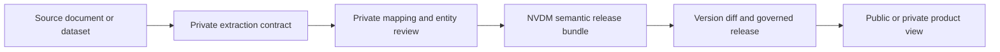
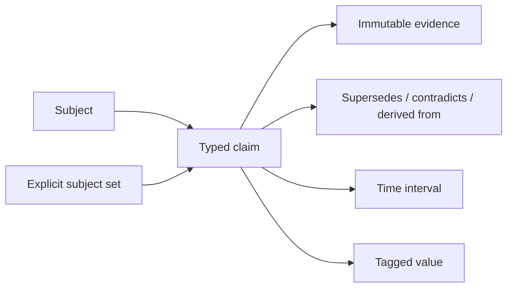

# NVDM semantic core candidate

**Status:** candidate 0.1 for review. It is not an accepted NVDM v1 contract,
is not registered in `scripts/validate_nvdm.py`, and is not used by a
production artifact.

## Decision

NVDM remains one data model. Source families such as monthly progress reports
(MPRs), STP inspections, groundwater reports and river-pollution datasets do
not get independent canonical models. They may have different private intake
contracts, but reviewed outputs converge on one small semantic graph:

The release bundle is an interoperability and validation unit. It is not a
database schema. The platform may persist these records in normalized tables,
subject to workspace RLS, while public releases can remain self-contained JSON.

## The graph

A subject is a stable real-world thing: a treatment facility, monitoring point,
local government, river reach or aquifer. A subject set represents an explicit
reported aggregation or analytical cohort. It prevents labels such as “two
municipalities combined” from being fabricated into canonical real-world
entities.

The candidate has four claim families:

| Family | Meaning | Example |
|---|---|---|
| Relationship | A typed connection between two subjects | outlet is part of an STP |
| Standing fact | A value intended to hold over a stated interval | design capacity or applicable standard |
| Observation | A measured, reported or estimated value at a time | outlet BOD result |
| Assessed gap | A reported or derived shortfall | treatment-capacity gap |

Monitoring locations are subjects, not strings embedded in readings. A
regulatory threshold is a standing-fact claim; an observation may point to the
threshold through `comparison_claim_ids`. The raw result and the rule used to
interpret it therefore remain independently reviewable.

## Public and private ownership

The public NVDM contract owns the minimum structure needed for durable
interoperability:

- stable subjects and explicit subject sets;
- evidence custody and locators;
- relationships, standing facts, observations and assessed gaps;
- tagged values, time intervals and lifecycle edges;
- executable validation of referential and custody invariants.

The private platform owns client- and method-specific operational knowledge:

- source-document extraction contracts and prompts;
- source fields mapped to NVDM concepts;
- entity-resolution candidates, aliases under review and reviewer decisions;
- customer records, storage paths, access policy and workflow state;
- unpublished crosswalks and higher-order ontology logic.

The structural schema accepting a namespaced `concept` does not publish or
accept a Neer Vazhvu concept vocabulary. Which concept definitions and
crosswalks become public remains an explicit product and IP decision.

## Value, time and absence

Values use a closed tagged union: quantity, range, text, terms, date or boolean.
A quantity always names its unit and qualifier. A range always names its unit.
Dates are real ISO years, year-months or dates. Time intervals use one precision
at both ends and cannot run backwards.

`null` is never shorthand for missing, unreported or not applicable. If a
source does not report a field, the private review workflow records that
coverage state; it does not manufacture a canonical claim. This keeps absence
semantics out of downstream analytics unless they have been deliberately
modelled.

## Evidence and custody

Each evidence record names an envelope source, a source version, the SHA-256 of
the immutable source artifact and a typed locator. A document fragment requires
a positive page number. Dataset, API and field records use record/field/fragment
locators as appropriate. Storage bucket keys and signed URLs are intentionally
absent: custody remains stable when delivery infrastructure changes.

Normalized page-text hashes, provider-result checksums and processor editions
remain in the platform's private document-observation receipt. Duplicating
those fields in the public graph would create a second canonicalization regime;
the governed projector instead binds its release to the reviewed private
receipt while publishing the source artifact and locator needed to verify the
claim.

Within a bundle, one `(source_id, source_version_id)` pair must resolve to one
artifact hash. Evidence and all claims share a global identifier namespace, so
an identifier cannot silently change type. Exact external identities cannot be
bound to two canonical subjects.

## History and derivation

Claims are append-only. A correction creates a new claim and points to the old
claim with `supersedes_claim_ids`; the old record remains addressable. A
superseding claim must keep the same subject and concept. Contradictions remain
visible through `contradicts_claim_ids`. A claim with `basis: derived` must name
its input claims through `derived_from_claim_ids`.

Model execution receipts are not yet an evidence kind. The current NVDM
envelope defines `provenance.sources` as external upstreams, so treating an
internal model run as an external source would corrupt lineage. Headwaters or a
future model-run contract should first define model, version, parameters,
inputs, environment and output custody; semantic claims can then link to that
receipt without changing their subject/claim shape.

## Pressure tests

| Pressure | Candidate response | Deliberate non-goal |
|---|---|---|
| One MPR reports a total for several municipalities | Explicit reported subject set | Inventing a combined municipality subject |
| One document contains several STPs | One canonical facility subject per resolved facility | One-candidate-per-document assumption |
| STP reading belongs to an inlet or outlet | Monitoring point subject plus `part-of` relationship | Free-text location on the observation |
| Result must be compared with a standard | Observation references a standing-fact claim | Baking pass/fail into the raw value |
| Two reports disagree | Both claims retained and linked as contradictions | Last-write-wins replacement |
| A later report corrects an earlier value | New claim supersedes the old claim | Mutating historical evidence |
| A source field is absent | No canonical claim is emitted | Null-as-unreported convention |
| A derived gap is published | Claim names evidence and input claims | Untraceable computed number |

## Acceptance path

The candidate can become a registered contract only after all of these gates:

1. Review confirms the public/private ontology and IP boundary.
2. STP and MPR private mappings both project into the candidate without
   source-family fields leaking into the core.
3. The concept vocabulary publication strategy is decided explicitly.
4. A projector round-trip proves stable IDs, evidence custody and repeatable
   output.
5. Platform persistence, workspace authorization and RLS are designed against
   the same graph without weakening tenant isolation.
6. A migration and rollback note identifies every consumer before any
   production artifact or `CONTRACTS` registration is added.

Until then, this PR reserves and tests the shape only. Removing it changes no
public data, runtime route or accepted conformance level.
